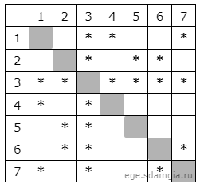
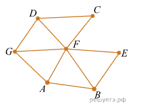

# Задание 1

На рисунке слева изображена схема дорог Н-ского района, в таблице звёздочкой обозначено наличие дороги из одного 
населённого пункта в другой. Отсутствие звёздочки означает, что такой дороги нет.

Каждому населённому пункту на схеме соответствует его номер в таблице, но неизвестно, какой именно номер. 
Определите, какие номера населённых пунктов в таблице могут соответствовать населённым пунктам A и G на схеме. 
В ответе запишите эти два номера в возрастающем порядке без пробелов и знаков препинания.