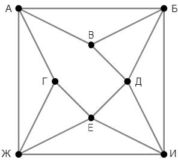
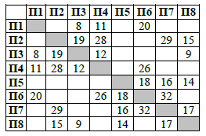

# Задание 10

На рисунке схема дорог изображена в виде графа, в таблице содержатся
сведения о длине этих дорог в километрах. Так как таблицу и схему рисовали
независимо друг от друга, нумерация населённых пунктов в таблице никак
не связана с буквенными обозначениями на графе. Известно, что дорога АБ
длиннее дороги ЖИ. Определите длину дороги ВД.

<link href="../../assets/style.css" rel="stylesheet" />

