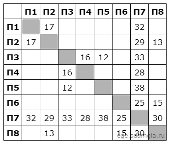
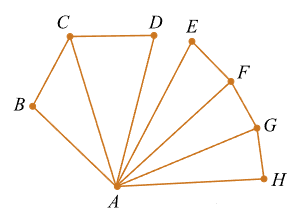

# Тема 1

### Пример решения простого задания

На рисунке схема дорог изображена в виде графа, в таблице содержатся сведения о длине этих дорог в километрах. 
Так как таблицу и схему рисовали независимо друг от друга, нумерация населённых пунктов в таблице никак не связана с 
буквенными обозначениями на графе. Известно, что дорога CD длиннее дороги EF. Определите сумму длин дорог АB и AG.




TODO: Пояснить составление table и graph

```python
from itertools import permutations

table = '16 19 23 25 27 32 34 39 43 46 47 52 58 61 64 68 69 72 78 74 85 86 87 91 93 96'
graph = 'АБ БА БВ ВБ АВ ВА АГ ГА ГД ДГ ГЕ ЕГ ЕЖ ЖЕ ЖД ДЖ АИ ИА ВК КВ ИК КИ ИЕ ЕИ ЖК КЖ'

for p in permutations('АБВГДЕЖИК'):
    new_graph = table
    for i in range(1, 10):
        new_graph = new_graph.replace(str(i), p[i - 1])
    if set(new_graph.split()) == set(graph.split()):
        print(p)
```

TODO: Пояснить результат

Ответ: 67