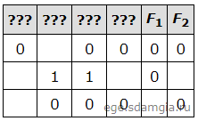

# Задание 11

Две логические функции заданы выражениями:

F1 = (x ∨ ¬y) → (w ≡ z)

F2 = (x ∨ ¬y) ≡ (w → z)

Дан частично заполненный фрагмент, содержащий неповторяющиеся строки таблицы истинности обеих функций. Определите, 
какому столбцу таблицы истинности соответствует каждая из переменных w, x, y, z.

В ответе напишите буквы w, x, y, z в том порядке, в котором идут соответствующие им столбцы (сначала буква, 
соответствующая первому столбцу; затем буква, соответствующая второму столбцу, и т.д.). Буквы в ответе пишите подряд, 
никаких разделителей между буквами ставить не нужно.