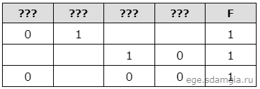

# Задание 2

Логическая функция F задаётся выражением:

((x ≡ y) → (¬z ∨ w)) ≡ ¬ ((w → x) ∨ (y → z))

Дан частично заполненный фрагмент, содержащий неповторяющиеся строки таблицы истинности функции F.

Определите, какому столбцу таблицы истинности соответствует каждая из переменных w, x, y, z.

В ответе напишите буквы w, x, y, z в том порядке, в котором идут соответствующие им столбцы (сначала буква, 
соответствующая первому столбцу; затем буква, соответствующая второму столбцу, и т.д.). 
Буквы в ответе пишите подряд, никаких разделителей между буквами ставить не нужно.