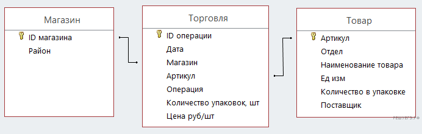

# Задание 12

В файле приведён фрагмент базы данных «Продукты», содержащей информацию о поставках товаров и их продаже. База данных 
состоит из трёх таблиц.

Таблица «Торговля» содержит записи о поставках и продажах товаров в магазинах города в июне 2021г. 
Таблица «Товар» содержит данные о товарах. Таблица «Магазин» содержит данные о магазинах.

На рисунке приведена схема базы данных, содержащая все поля каждой таблицы и связи между ними.

Используя информацию из приведённой базы данных, определите магазин, продавший за месяц наибольшее количество чая зелёного.

В ответе запишите ID магазина — так, как он указан в базе.