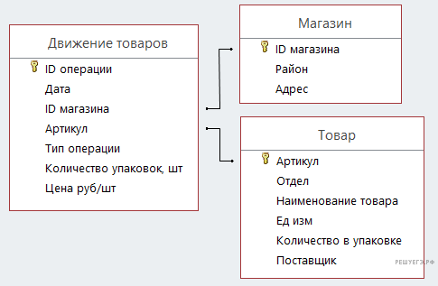

# Задание 3

В файле приведён фрагмент базы данных «Продукты», содержащей информацию о поставках товаров и их продаже. 
База данных состоит из трёх таблиц.

Таблица «Движение товаров» содержит записи о поставках товаров в магазины города в первой декаде июня 2021 г. и о 
продаже товаров в этот же период. Таблица «Товар» содержит данные о товарах. Таблица «Магазин» содержит адреса магазинов.

На рисунке приведена схема базы данных, содержащая все поля каждой таблицы и связи между ними.

**Используя информацию из приведённой базы данных, определите общую стоимость продуктов, поставленных за указанный период 
с макаронной фабрики в магазины Первомайского района.**

В ответе запишите целое число — найденную общую стоимость в рублях.
